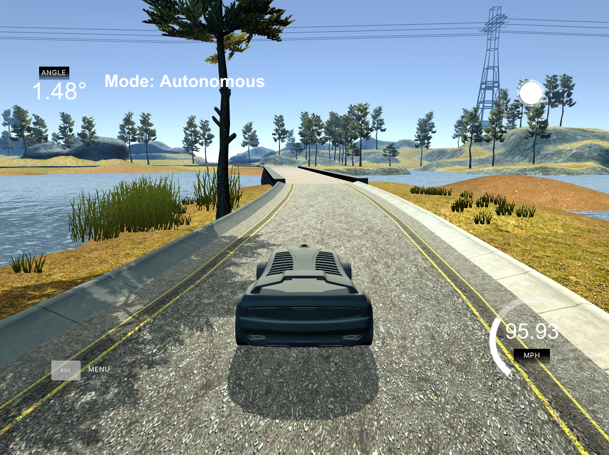

# Self-Driving Car Engineer Nanodegree Program

## PID Control - Project 4

    

## Basic Build Instructions

1. Clone this repo.
2. Make a build directory: `mkdir build && cd build`
3. Compile: `cmake .. && make`
4. Run it: `./pid`. 

## Reflections

